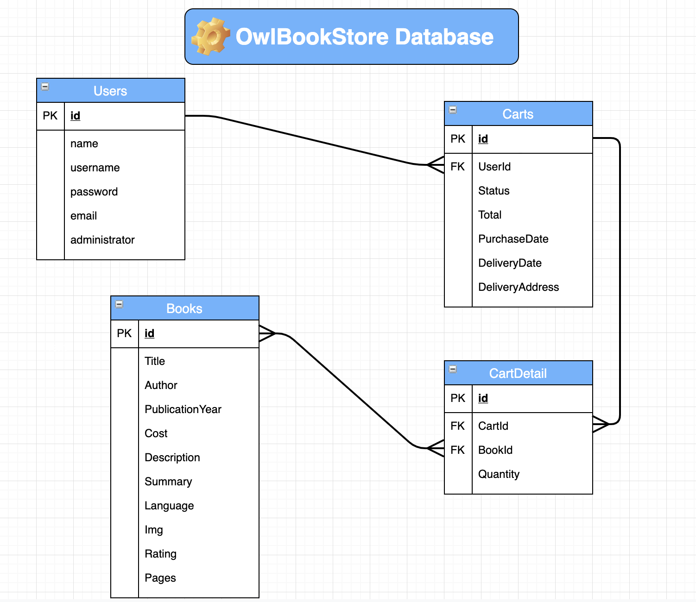

# book-store-backend
BackEnd Application for an Owl Book Store

This project was done by Gladys Cruz and Socorro Pinto

This app serves JSON data only. There are no views. 
Note - this app has no views and each endpoint is prefaced with `/api`.

We have the following routes in our server.js:

```js
app.use("/api/auth", require("./controllers/authController.js"));
app.use("/api/users", require("./controllers/usersController.js"));
app.use("/api/books", require("./controllers/booksController.js"));
app.use("/api/carts", require("./controllers/cartsController.js"));
app.use("/api/cartdets", require("./controllers/cartDetailsController.js"));
```

## The database we used is called:

### owlBookStore

## The Entity Relation Diagram it is shown below:



### Sequelize is included in the app with the following models:

1. `User`
2. `Books`
3. `Cart`
4. `CartDetails`

Run `npx sequelize db:migrate` to create the tables in the database.
Also, the seeds for `Users` and `Books` are included, run `npx sequelize-cli db:seed:all` to get the info in the database.

1. Run `nodemon`.
1. Open Postman to confirm that your app is working on `localhost:3000/`.


<br>

## Routes

You have the following routes available.

#### `server.js`

- GET `localhost:3000/`

#### `controllers/authController.js`

- POST `localhost:3000/api/auth/signup`
- POST `localhost:3000/api/auth/login`
- GET `localhost:3000/api/auth/logout`

#### `controllers/usersController.js`

- GET `localhost:3000/api/users/profile/:id`

#### `controllers/booksController.js`

Get all the books, accept limit and offset parameters:
- GET `localhost:3000/api/books/`

`localhost:3000/api/books/search?limit=6&offset=0`

Get book by id:
- GET `localhost:3000/api/books/:id`

Get books by tag (also accept limit and offset parametters):
- GET `localhost:3000/api/books/search`

`localhost:3000/api/books/search?tag=whatyouwanttosearch`
Will seach in books titles and authors.

Get the most rated books (accept limit and offset parameters).
- GET `localhost:3000/api/books/mostrated`

Get the most rated books (accept limit and offset parameters).
- GET `localhost:3000/api/books/mostselled`

Routes to Create, Update and Delete a Book (functionality not allowed in the frontEnd application)
- POST `localhost:3000/api/books/`
- PUT `localhost:3000/api/books/:id`
- DELETE `localhost:3000/api/books/:id`


#### `controllers/cartsController.js`

Route to get all the carts (not used in frontEnd)
- GET `localhost:3000/api/carts/`

Get all the carts with status='New' by userId - Returns also de cartDetails and Book Models
- GET `localhost:3000/api/carts/byuser/:user/`

Get all the carts with status='History' by userId - Returns also de cartDetails and Book Models
- GET `localhost:3000/api/carts/byuserhis/:user/`

Routes to Create, Update and Delete a Cart 
- GET `localhost:3000/api/carts/:id`
- POST `localhost:3000/api/carts/`

Returns also the cartDetails and Book Models
- PUT `localhost:3000/api/carts/:id`
- DELETE `localhost:3000/api/carts/:id`

#### `controllers/cartDetails.js`

Routes to do the CRUD operations in the cartDetails table.
- GET `localhost:3000/api/cartdets/`
- GET `localhost:3000/api/cartdets/:id`
- POST `localhost:3000/api/cartdets/`
- PUT `localhost:3000/api/cartdets/:id`
- DELETE `localhost:3000/api/cartdets/:id`

<br>

## To Deploy

It is deployed in Heroku in the following link:
- [Link to Deployment](link)

- [Heroku Node Express Deployment](https://git.generalassemb.ly/jdr-0622/node-express-heroku-deployment)
- [Heroku React Deployment](https://blog.heroku.com/deploying-react-with-zero-configuration#create-and-deploy-a-react-app-in-two-minutes)
- [Project 4 Starter Code Heroku Deployment Link](https://deere-project4-express.herokuapp.com/)

  

<br>

## User Stories:

1.- Do the Basic GET, POST, PUT and DELETE for all the tables in the database.
2.- Do the routes for mostselled, mostrated and search books.
3.- Modificate the basic routes to return additionnal values.


